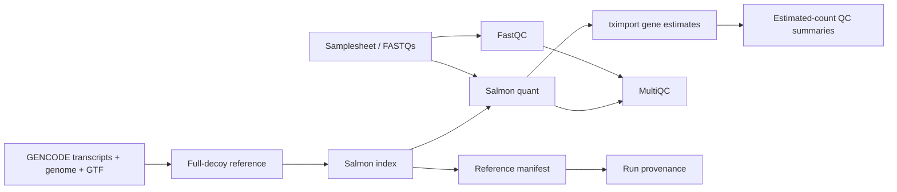

# simple-nextflow-salmon

[](https://github.com/Thokas99/simple-nextflow-salmon/actions/workflows/ci.yml)
[](https://github.com/Thokas99/simple-nextflow-salmon/releases)
[](LICENSE)

Small paired-end bulk RNA-seq quantification workflow using FastQC, MultiQC, GENCODE full-decoy Salmon indexing, Salmon quantification, and tximport gene-level summarization.

It deliberately does not do trimming, alignment, filtering, normalization, differential expression, or biological interpretation.

## Quick Start

Clone the pipeline and put the GENCODE reference files in the bundled reference folder:

```bash
git clone https://github.com/Thokas99/simple-nextflow-salmon.git
cd simple-nextflow-salmon
```

Expected reference files:

```text
reference/GRCh38_GENCODE/raw/gencode.v50.transcripts.fa.gz
reference/GRCh38_GENCODE/raw/GRCh38.p14.genome.fa.gz
reference/GRCh38_GENCODE/raw/gencode.v50.chr_patch_hapl_scaff.annotation.gtf.gz
```

Run from the directory that contains your FASTQ folder. Relative paths are resolved from that directory:

```bash
nextflow run simple_nextflow_salmon/ \
  --fastq_dir fastq2 \
  --outdir output \
  -profile conda
```

If you already have a samplesheet, use it directly:

```bash
nextflow run simple_nextflow_salmon/ \
  --samplesheet fastq2/samplesheet.csv \
  --outdir output \
  -profile conda
```

Only pass `--reference_dir` when the reference is outside the pipeline checkout.

## Workflow



Reference building and FastQC start independently. Salmon waits only for reads and a compatible index.

## Requirements

- Nextflow `>=24.10.0`
- Java 17+
- One execution backend:
  - `-profile conda` with Micromamba/Mamba/Conda
  - `-profile docker`
  - `-profile apptainer`

Conda dependencies are pinned in `envs/salmon-rnaseq.yml`. Container profiles use versioned BioContainers images where available; conda remains the most portable HPC profile.

## Reference Inputs

Defaults are pinned for reproducibility, not because they are eternally current:

| Parameter | Default |
| --- | --- |
| `--gencode_release` | `50` |
| `--genome_patch` | `14` |

Expected default files:

```text
reference/GRCh38_GENCODE/raw/gencode.v50.transcripts.fa.gz
reference/GRCh38_GENCODE/raw/GRCh38.p14.genome.fa.gz
reference/GRCh38_GENCODE/raw/gencode.v50.chr_patch_hapl_scaff.annotation.gtf.gz
```

Download the matching GENCODE Human `ALL` files from:

```text
https://www.gencodegenes.org/human/
```

## Reference Cache

The derived reference is reused only when `reference_manifest.json` proves compatibility. The manifest records raw-input SHA256 checksums, GENCODE release, GRCh38 patch, Salmon version, k-mer size, index options, and decoy-generation method.

If an existing cache is incompatible, the workflow fails with an instruction to rebuild:

```bash
--rebuild_reference true
```

The rebuild removes only the known derived files/index under the selected reference directory.

## Samplesheet

Required CSV/TSV columns:

```csv
sample,fastq_1,fastq_2
UDB001,/abs/path/UDB001_R1.fastq.gz,/abs/path/UDB001_R2.fastq.gz
```

Rules:

- One row is one final biological sample.
- Sample IDs must be safe path names: letters, numbers, `.`, `_`, `-`.
- FASTQ paths may be absolute or relative to the run directory.
- Lanes are not silently merged.
- Extra columns are rejected.

Automatic detection supports names such as:

```text
UDB001_R1.fastq.gz
UDB001_R2.fastq.gz
UDB001_L001_R1.fq.gz
UDB001_L001_R2.fq.gz
```

The lane token remains part of the sample ID. Manual helper:

```bash
python3 scripts/make_samplesheet.py /path/to/fastqs -o samplesheet.csv
```

## Parameters

| Parameter | Default | Description |
| --- | --- | --- |
| `--samplesheet` | none | CSV/TSV input table |
| `--fastq_dir` | none | Generate samplesheet from paired FASTQs |
| `--generated_samplesheet` | none | Output path when `--fastq_dir` is used without `--samplesheet` |
| `--outdir` | `results` | Output directory |
| `--reference_dir` | `reference/GRCh38_GENCODE/raw` | Raw reference directory |
| `--gencode_release` | `50` | Expected GENCODE release |
| `--genome_patch` | `14` | Expected GRCh38 patch |
| `--lib_type` | `A` | Salmon library type |
| `--salmon_k` | `31` | Salmon index k-mer size |
| `--validate_only` | `false` | Validate and stop |
| `--rebuild_reference` | `false` | Force reference/index rebuild |

Use `nextflow run . --help` for a concise parameter overview.

## Outputs

| Output | Path |
| --- | --- |
| FastQC | `results/qc/fastqc/` |
| MultiQC | `results/qc/multiqc/multiqc_report.html` |
| Salmon quantifications | `results/salmon/<sample>/` |
| tximport estimated counts | `results/tximport/gene_counts.tsv` |
| tximport abundance | `results/tximport/gene_abundance.tsv` |
| Estimated-count QC | `results/summary/estimated_count_summary.tsv` |
| Salmon mapping QC | `results/summary/salmon_mapping_summary.tsv` |
| Software versions | `results/pipeline_info/software_versions.yml` |
| Run provenance | `results/pipeline_info/run_provenance.json` |
| Nextflow reports | `results/pipeline_info/` |

`gene_counts.tsv` contains unrounded tximport estimated fragment counts with `countsFromAbundance = "no"`. The workflow does not perform filtering, library-size normalization, or differential expression.

## Profiles

```bash
nextflow run . --samplesheet samplesheet.csv -profile conda
nextflow run . --samplesheet samplesheet.csv -profile docker
nextflow run . --samplesheet samplesheet.csv -profile apptainer
```

Typical HPC use is `-profile conda` or `-profile apptainer`, depending on site policy.

## Resume

```bash
nextflow run . \
  --samplesheet samplesheet.csv \
  --outdir results \
  -profile conda \
  -resume
```

## Changes in v0.2.0

- Version metadata updated from stale `0.1.0` references to `0.2.0`.
- Reference reuse now requires a compatibility manifest, not just file existence.
- `--gencode_release` and `--genome_patch` are explicit reproducibility parameters.
- FastQC/MultiQC no longer block reference construction.
- MultiQC now runs at the end and includes FastQC plus Salmon outputs.
- `raw_count_summary.tsv` was renamed to `estimated_count_summary.tsv`.
- Added software-version and run-provenance outputs.
- Added CI, tests, MIT license, and citation metadata.

## Troubleshooting

| Problem | Fix |
| --- | --- |
| Incompatible derived reference | Rerun with `--rebuild_reference true` after reviewing the selected raw reference files |
| Missing GENCODE file | Download the matching release/patch `ALL` file into `--reference_dir` |
| Unsafe sample ID | Use only letters, numbers, `.`, `_`, `-` |
| Relative FASTQ path fails from GitHub run | Use absolute local paths or paths relative to the launch directory |
| Docker/Apptainer image unavailable at your site | Use `-profile conda` or mirror the listed BioContainers images |

## Citation

Please cite the tools used by this workflow:

- Nextflow
- Salmon
- tximport
- FastQC
- MultiQC
- GENCODE

Also see `CITATION.cff`.

## Release

Do not create the `v0.2.0` tag until the upgrade PR is reviewed and merged.
