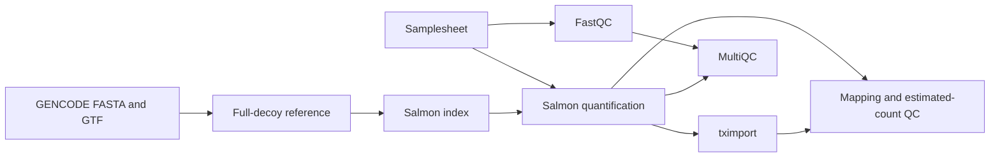

# simple-nextflow-salmon

[](https://github.com/Thokas99/simple-nextflow-salmon/actions/workflows/ci.yml)
[](https://github.com/Thokas99/simple-nextflow-salmon/releases)
[](LICENSE)

A small paired-end bulk RNA-seq workflow for FastQC, MultiQC, GENCODE full-decoy Salmon quantification, and tximport gene-level summarization.

It does not trim, align, filter, normalize, test differential expression, or interpret biology.

## Quick Start

### Local Clone

```bash
# Download the workflow
git clone https://github.com/Thokas99/simple-nextflow-salmon.git
cd simple-nextflow-salmon

# Optional: create the samplesheet from paired FASTQ filenames
python3 scripts/make_samplesheet.py \
  /absolute/path/to/fastqs \
  -o /absolute/path/to/samplesheet.csv

# Check the samplesheet and reference paths without running any process
nextflow run . \
  --samplesheet /absolute/path/to/samplesheet.csv \
  --reference_dir /absolute/path/to/reference/GRCh38_GENCODE/raw \
  --outdir /absolute/path/to/results \
  --validate_only true \
  -profile conda

# Run the workflow
nextflow run . \
  --samplesheet /absolute/path/to/samplesheet.csv \
  --reference_dir /absolute/path/to/reference/GRCh38_GENCODE/raw \
  --outdir /absolute/path/to/results \
  -profile conda \
  -resume
```

### GitHub Release

After a release tag has been created:

```bash
nextflow run Thokas99/simple-nextflow-salmon \
  -r <RELEASE_TAG> \
  --samplesheet /absolute/path/to/samplesheet.csv \
  --reference_dir /absolute/path/to/reference/GRCh38_GENCODE/raw \
  --outdir /absolute/path/to/results \
  -profile conda \
  -resume
```

Replace `<RELEASE_TAG>` with an existing tag from the [releases page](https://github.com/Thokas99/simple-nextflow-salmon/releases). Nextflow downloads only the workflow code; FASTQs, reference files, work files, and results remain on the machine where the command is launched.

## Workflow



FastQC and reference preparation can start independently. MultiQC runs after FastQC and Salmon so its report includes both.

## Requirements

- Nextflow `>=24.10.0`
- Java 17+
- Conda, Mamba, or Micromamba available to Nextflow

Conda is the only supported execution backend. Nextflow creates and caches the pinned environment from `envs/salmon-rnaseq.yml`; users do not activate it manually.

## Samplesheet

The workflow accepts one explicit CSV input:

```csv
sample,fastq_1,fastq_2
UDB001,/absolute/path/UDB001_R1.fastq.gz,/absolute/path/UDB001_R2.fastq.gz
```

The three columns are required exactly. Sample IDs must contain only letters, numbers, `.`, `_`, or `-`; IDs and FASTQ paths must be unique; R1 and R2 must exist and differ. Relative paths are resolved from the directory where Nextflow was launched.

The optional helper scans paired filenames before the workflow is launched:

```bash
python3 scripts/make_samplesheet.py /absolute/path/to/fastqs -o /absolute/path/to/samplesheet.csv
```

One detected pair becomes one sample row. Lane tokens remain in sample IDs, and lanes are never silently merged.

## Reference

The default reference inputs are:

```text
GRCh38_GENCODE/
└── raw/
    ├── gencode.v50.transcripts.fa.gz
    ├── GRCh38.p14.genome.fa.gz
    └── gencode.v50.chr_patch_hapl_scaff.annotation.gtf.gz
```

They produce:

```text
GRCh38_GENCODE/
└── derived/
    ├── gentrome.fa
    ├── decoys.txt
    ├── annotation.gtf.gz
    ├── salmon_index/
    └── reference_manifest.tsv
```

The transcript and genome FASTAs are decompressed, checked for duplicate identifiers, and concatenated in that order. Genome identifiers become decoys, every decoy is checked against the gentrome, and Salmon builds the index with `--gencode`.

Before each run, the workflow checks that all five derived artifacts are non-empty; the Salmon index contains its core Piscem files; `info.json` reports the expected Salmon version, k-mer size, references, decoys, and equivalence-class table; and the manifest matches the requested GENCODE release, genome patch, filenames, Salmon version, k-mer size, and `--gencode` option. A complete compatible reference is reused. Otherwise, only these known derived artifacts are removed and rebuilt automatically. Multi-gigabyte files are not checksummed on every launch.

## Parameters

| Parameter | Default | Description |
| --- | --- | --- |
| `--samplesheet` | required | CSV with `sample,fastq_1,fastq_2` |
| `--reference_dir` | `reference/GRCh38_GENCODE/raw` | Raw GENCODE reference directory |
| `--outdir` | `results` | Results directory |
| `--gencode_release` | `50` | GENCODE release |
| `--genome_patch` | `14` | GRCh38 patch |
| `--salmon_k` | `31` | Salmon index k-mer size |
| `--lib_type` | `A` | Salmon library type |
| `--validate_only` | `false` | Validate inputs without running processes |

User inputs and outputs may be absolute or relative to the launch directory. `projectDir` is used only for workflow modules, scripts, and the Conda YAML bundled with the repository.

## Outputs

| Output | Path |
| --- | --- |
| FastQC | `results/qc/fastqc/` |
| MultiQC | `results/qc/multiqc/multiqc_report.html` |
| Salmon quantifications | `results/salmon/<sample>/` |
| Transcript-to-gene map | `results/tximport/tx2gene.tsv` |
| Estimated gene counts | `results/tximport/gene_counts.tsv` |
| Gene abundance | `results/tximport/gene_abundance.tsv` |
| Gene effective length | `results/tximport/gene_length.tsv` |
| tximport object | `results/tximport/tximport_object.rds` |
| Sample metadata | `results/tximport/sample_metadata.tsv` |
| Mapping QC | `results/summary/salmon_mapping_summary.tsv` |
| Estimated-count QC | `results/summary/estimated_count_summary.tsv` |
| Per-sample gene-count QC | `results/summary/gene_count_summary.tsv` |

`gene_counts.tsv` contains unrounded tximport estimated fragment counts with `countsFromAbundance = "no"`. These are estimated counts, not raw integer read counts. Versioned GENCODE transcript and gene identifiers are retained.

## Resume

Use the same command and add `-resume`. Nextflow reuses completed tasks from its work directory; the reference manifest separately controls reuse of the published Salmon index.

## Troubleshooting

| Problem | Resolution |
| --- | --- |
| Missing reference file | Check the exact GENCODE release and GRCh38 patch filenames under `--reference_dir` |
| Incomplete or incompatible derived reference | The known derived artifacts are removed and rebuilt automatically |
| FASTQ not found | Use an absolute path or a path relative to the launch directory |
| Unsafe or duplicate sample | Correct the samplesheet; lanes must have distinct sample IDs |
| Conda solve fails | Confirm Conda/Mamba is available and retry after clearing only the failed cached environment |

## License and Citation

MIT licensed. Cite Nextflow, Salmon, tximport, FastQC, MultiQC, and the GENCODE reference used in the analysis. Repository metadata is in `CITATION.cff`.
