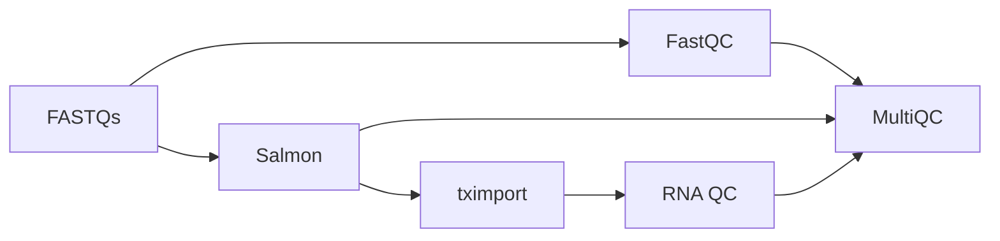

# simple-nextflow-salmon

[](https://github.com/Thokas99/simple-nextflow-salmon/actions/workflows/ci.yml)
[](https://github.com/Thokas99/simple-nextflow-salmon/releases)
[](LICENSE)

Small, reproducible paired-end bulk RNA-seq workflow: FastQC, full-decoy Salmon selective-alignment quantification, and gene-level tximport matrices, with native Salmon and pipeline RNA QC in MultiQC.


```mermaid
flowchart LR
  A[FASTQs] --> B[FastQC]
  A --> C[Salmon]
  C --> D[tximport]
  B --> E[MultiQC]
  C --> E
  D --> F[RNA QC]
  F --> E
```

## Quick start

Requirements: Java 17+, Nextflow `>=24.10.0`, and Conda/Micromamba.

For the v0.4.0 release, after the tag exists:

```bash
NXF_ANSI_LOG=0 nextflow run Thokas99/simple-nextflow-salmon \
  -r v0.4.0 -profile conda --fastq_dir /data/fastqs \
  --reference_dir /data/reference/GRCh38_GENCODE/raw --outdir results
```

The explicit samplesheet form is:

```bash
NXF_ANSI_LOG=0 nextflow run Thokas99/simple-nextflow-salmon \
  -r v0.4.0 -profile conda --samplesheet samplesheet.csv \
  --reference_dir /data/reference/GRCh38_GENCODE/raw --outdir results
```

For the current local `main`:

```bash
NXF_ANSI_LOG=0 nextflow run . -profile conda \
  --fastq_dir /data/fastqs \
  --reference_dir /data/reference/GRCh38_GENCODE/raw --outdir results
```

`NXF_ANSI_LOG=0` (or `-ansi-log false`) disables Nextflow's animated ANSI status interface, giving line-oriented logs suited to `nohup`, log files, HPC jobs, and long sequencing runs. Use exactly one of `--fastq_dir` and `--samplesheet`.

## Input

Automatic discovery supports `.fastq`, `.fastq.gz`, `.fq`, and `.fq.gz` with:

- simple: `SAMPLE_R1.fastq.gz`, `SAMPLE_R2.fastq.gz`
- Illumina: `SAMPLE_S1_L001_R1_001.fastq.gz`, with lanes grouped as `SAMPLE`
- MGI: `V350387909_L01_UDB001_1.fq.gz`, with lanes grouped as `UDB001`

Select `--fastq_naming auto|illumina|mgi|simple`. Ambiguous names, orphan mates, duplicate assignments, unsafe sample IDs, basename collisions, and mixed conventions fail with file-specific errors. An explicit CSV has exactly `sample,fastq_1,fastq_2`; repeated sample rows are technical lanes. The exact normalized mapping used by the run is always written to `results/pipeline_info/resolved_samplesheet.csv`.

## Reference

For the defaults (`--gencode_release 50 --genome_patch 14`), provide:

```text
/data/reference/GRCh38_GENCODE/raw/
├── gencode.v50.transcripts.fa.gz
├── GRCh38.p14.genome.fa.gz
└── gencode.v50.chr_patch_hapl_scaff.annotation.gtf.gz
```

The workflow builds and reuses an immutable, source-fingerprinted full-decoy Salmon cache. Cache identity includes reference release/patch, source SHA-256 fingerprints, Salmon version from the committed Conda environment, index k-mer, and index options. See [reference caching](docs/reference-cache.md).

## Outputs

```text
results/
├── qc/{fastqc,multiqc}/
├── qc/salmon_metrics.tsv
├── salmon/<sample>/quant.sf
├── tximport/
├── summary/sample_count_summary.tsv
└── pipeline_info/{resolved_samplesheet.csv,run_provenance.json,...}
```

Salmon `quant.sf` contains fractional estimated fragment counts, TPM, and effective lengths. tximport provides gene estimated-count, TPM, effective-length, annotation, `tx2gene`, and complete RDS outputs with `countsFromAbundance = "no"`.

## QC and MultiQC

`qc/salmon_metrics.tsv` copies native fields from each Salmon `aux_info/meta_info.json`: `num_processed`, `num_mapped`, `percent_mapped`, detected library type, fragment-length statistics, Salmon version, and normalized FASTQ-pair count. It does not invent alignment, quantification, or compatibility rates.

MultiQC uses its native `fastqc` and `salmon` modules plus pipeline custom content for post-tximport `Estimated library` and `Detected genes`. It reports QC metrics without automatic sample filtering or PASS/FAIL decisions.

## Conda / execution profiles

`-profile conda` is the primary local/HPC path. Nextflow manages the pinned `envs/salmon-rnaseq.yml` environment and enables Micromamba; manual activation is not required. `docker` and `apptainer`/`singularity` use `ghcr.io/thokas99/simple-nextflow-salmon:0.4.0` after release. `ci` caps process resources and is composed with `conda` for miniature workflow tests.

## Reproducibility

Pin a release tag or commit and retain the raw references, resolved samplesheet, cache manifest, run provenance, execution trace, and tximport RDS. Relative input paths resolve from the launch directory. Use `-resume` for interrupted runs and `--validate_only true` before expensive work.

## Citation

See [`CITATION.cff`](CITATION.cff). Also cite Salmon, tximport, FastQC, MultiQC, and Nextflow as appropriate.

## Development

```bash
python3 -m unittest discover -s tests -p 'test_*.py'
bash tests/test_validation.sh
bash tests/test_stub_workflow.sh
bash tests/test_real_workflow.sh
NXF_SYNTAX_PARSER=v2 nextflow lint .
git diff --check
```

See [installation](docs/installation.md), [input rules](docs/inputs.md), [local execution](docs/local-execution.md), and [release procedure](docs/release.md).
