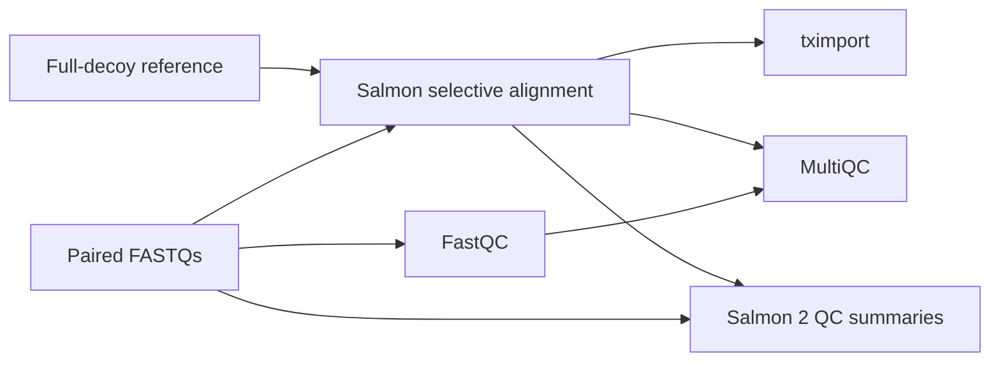

# Simple-nextflow-Salmon (SnS)

[](https://github.com/Thokas99/simple-nextflow-salmon/actions/workflows/ci.yml)
[](https://github.com/Thokas99/simple-nextflow-salmon/releases)
[](LICENSE)
[](https://www.nextflow.io/)

Plug-and-play paired-end bulk RNA-seq quantification with Salmon selective alignment, tximport, FastQC, and MultiQC—without generating BAM files.

## Why SnS?

SnS keeps one narrow, reproducible path from FASTQs to validated transcript- and gene-level abundance estimates. Lane FASTQs remain visible to FastQC, while technical replicates are combined into one Salmon task and one tximport column per biological sample.


```mermaid
flowchart LR
  A[Paired FASTQs] --> B[FastQC]
  A --> C[Salmon selective alignment]
  R[Full-decoy reference] --> C
  C --> D[tximport]
  A --> E[Input fragment counts]
  C --> E[Salmon 2 QC summaries]
  B --> F[MultiQC]
  C --> F
```

## Scope

SnS provides reference construction, FastQC, direct transcript quantification, tximport gene aggregation, QC summaries, MultiQC, and provenance. It deliberately does not perform genome alignment, BAM generation, trimming, differential expression, integerization of estimated counts, bootstraps/Gibbs sampling, or single-cell analysis.

## Features

- Salmon 2.3.4 full-decoy selective alignment with `--deterministic`, `--seqBias`, and `--gcBias`.
- Automatic library-type detection by default (`--lib_type A`).
- Lane-aware samplesheet generation and strict quoted-CSV validation.
- Immutable, source-fingerprinted reference caches safe for concurrent runs.
- Conda, Docker, Apptainer/Singularity, and lightweight CI profiles.
- Versioned transcript/gene identifiers, complete tximport RDS, matrices, QC, and sanitized run provenance.

## Quick start

Requirements: Nextflow `>=24.10.0`, Java 17+, and Conda/Micromamba.

```bash
git clone https://github.com/Thokas99/simple-nextflow-salmon.git
cd simple-nextflow-salmon
python3 scripts/make_samplesheet.py /data/fastqs -o samplesheet.csv
nextflow run . -profile conda \
  --samplesheet samplesheet.csv \
  --reference_dir /data/reference/GRCh38_GENCODE/raw \
  --outdir results
```

See [installation](docs/installation.md), [local execution](docs/local-execution.md), and [HPC/Apptainer](docs/hpc-apptainer.md).

## Execution profiles

| Profile | Runtime | Use |
|---|---|---|
| `conda` | Pinned `envs/salmon-rnaseq.yml` via Micromamba | Local/HPC default |
| `docker` | `ghcr.io/thokas99/simple-nextflow-salmon:0.3.1` | Docker hosts after the 0.3.1 release image is published |
| `apptainer` / `singularity` | Same pinned OCI image | HPC container execution |
| `ci` | Resource caps only | Combine with another profile for miniature tests |

The environment contains Salmon, FastQC, MultiQC, seqkit, Python, R, data.table, jsonlite, and tximport. edgeR and rtracklayer are not included. See the [dependency policy](docs/installation.md#dependency-policy).

## Samplesheet

The CSV must have exactly these columns and may use quoted fields:

```csv
sample,fastq_1,fastq_2
Patient01,/data/Patient01_S1_L001_R1_001.fastq.gz,/data/Patient01_S1_L001_R2_001.fastq.gz
Patient01,/data/Patient01_S1_L002_R1_001.fastq.gz,/data/Patient01_S1_L002_R2_001.fastq.gz
```

Repeated `sample` values are ordered technical replicates. FastQC runs twice; Salmon runs once with ordered R1/R2 lists. Sample IDs must match `[A-Za-z0-9][A-Za-z0-9_.-]*`. Files may end in `.fastq`, `.fastq.gz`, `.fq`, or `.fq.gz`. Full rules are in [input and samplesheet rules](docs/inputs.md).

Generate or preview a nested FASTQ directory:

```bash
python3 scripts/make_samplesheet.py /data/fastqs --dry-run
python3 scripts/make_samplesheet.py /data/fastqs -o samplesheet.csv
```

The generator strips standard `_S1_L001_R1_001` Illumina suffixes to derive the biological sample. Use `--lanes-as-samples` only when lanes intentionally represent separate samples, and `--overwrite` to replace an existing CSV.

## References and cache

For the defaults (`--gencode_release 50 --genome_patch 14`), provide:

```text
reference/GRCh38_GENCODE/raw/
├── gencode.v50.transcripts.fa.gz
├── GRCh38.p14.genome.fa.gz
└── gencode.v50.chr_patch_hapl_scaff.annotation.gtf.gz
```

Derived artifacts are built in task work directories and atomically published beneath a SHA-256 cache key. The identity includes release, patch, tool versions, k-mer size, index options, and all three source-file fingerprints. Existing cache entries are never deleted or overwritten. To refresh deliberately, use `--refresh_reference true` with an empty `--reference_cache_dir`; selecting an existing immutable entry fails safely. Remove obsolete fingerprint directories manually only after confirming no runs use them. Details: [reference caching](docs/reference-cache.md).

## Main parameters

| Parameter | Default | Meaning |
|---|---:|---|
| `--samplesheet` | required | Input CSV |
| `--outdir` | `results` | Output directory |
| `--reference_dir` | `reference/GRCh38_GENCODE/raw` | Raw GENCODE files |
| `--reference_cache_dir` | sibling `derived` | Immutable cache root |
| `--gencode_release` | `50` | GENCODE release |
| `--genome_patch` | `14` | GRCh38 patch |
| `--salmon_k` | `31` | Odd Salmon index k-mer, 1–31 |
| `--lib_type` | `A` | Salmon paired-end library code |
| `--validate_only` | `false` | Validate inputs/cache without tasks |
| `--refresh_reference` | `false` | Build into an empty explicitly selected cache root |

CPU and memory parameters are maintained in [`nextflow_schema.json`](nextflow_schema.json).

## Outputs

```text
results/
├── qc/{fastqc,multiqc}/
├── qc/input_fragment_counts.tsv
├── qc/salmon_metrics.tsv
├── salmon/<sample>/quant.sf
├── tximport/
├── summary/
└── pipeline_info/
```

| Output | Contract |
|---|---|
| `qc/input_fragment_counts.tsv` | R1 record counts summed across technical lanes; one paired R1/R2 record pair is one input fragment |
| `qc/salmon_metrics.tsv` | Salmon 2.3.4 input, aligned, and quantified fragment counts with explicit rates and provenance |
| `salmon/<sample>/quant.sf` | Transcript length, effective length, TPM, and fractional estimated fragment counts |
| `tximport/salmon_gene_estimated_counts.tsv` | Gene estimated counts; never rounded or integerized |
| `tximport/salmon_gene_tpm.tsv` | Gene-level TPM |
| `tximport/salmon_gene_average_effective_length.tsv` | tximport gene effective lengths |
| `tximport/salmon_gene_tximport.rds` | Authoritative complete tximport object; `countsFromAbundance = "no"` |
| `tximport/tx2gene.tsv` | Exactly `transcript_id`, `gene_id`, retaining versions |
| `tximport/gene_annotation.tsv` | Gene ID, symbol, and reliable gene type; gene ID remains primary |
| `summary/sample_count_summary.tsv` | Per-sample total estimated fragments and detected genes |
| `summary/gene_count_summary.tsv` | Deprecated 0.3 compatibility copy; removal planned before 1.0.0 |
| `pipeline_info/run_provenance.{json,tsv}` | Sanitized version, profile, parameters, fingerprints, sample counts, and state |
| `pipeline_info/execution_*`, `pipeline_dag.html` | Nextflow report, timeline, trace, and DAG |

Fractional counts are Salmon model estimates, not observed integer read counts. TPM is within-sample relative abundance. Effective lengths adjust transcript lengths for fragment-length effects. Gene symbols are annotations and may be non-unique or change; versioned `gene_id` is the stable primary key. See [outputs and downstream analysis](docs/outputs.md).

### Salmon 2 QC semantics

```text
Input fragments
      ↓ alignment
Aligned fragments
      ↓ strand compatibility
Quantified fragments
```

`alignment_rate = aligned / input × 100`, `quantification_rate = quantified / input × 100`, and `compatibility_rate = quantified / aligned × 100`. For paired-end data, one R1/R2 record pair is one input fragment; R1 is counted once per pair and technical lanes are summed per biological sample. Compatibility is conditional on aligned fragments and is not an overall FASTQ mapping rate. SnS calculates all three rates explicitly and reports them as `Align %`, `Quant %`, and `Compat %` in MultiQC.

### edgeR

Install edgeR separately, then use its tximport-aware constructor:

```r
txi <- readRDS("results/tximport/salmon_gene_tximport.rds")
y <- edgeR::DGEListFromTximport(txi)
y <- edgeR::calcNormFactors(y)
```

Do not round `txi$counts` before this step.

## Reproducibility and provenance

Pin a Git tag or commit, keep the raw references, samplesheet, cache manifest, `run_provenance.json`, trace, and complete tximport RDS. Provenance excludes tokens, secrets, usernames, and unnecessary absolute input paths.

## Troubleshooting

| Problem | Action |
|---|---|
| Ambiguous FASTQ name | Rename to a supported simple or complete Illumina pattern; SnS does not guess |
| Quoted CSV rejected | Require exactly three headers and standards-compliant quoting |
| Cache not reused | Compare the fingerprint manifest, source files, k-mer, and Salmon version |
| Conda solve fails | Use Micromamba with a clean cache and the committed environment file |
| Container image unavailable | The versioned image is published by the tag release workflow; use `conda` before release |
| Low/zero mapping | Verify read/reference identity, library orientation, and synthetic/test data quality |

More cases: [troubleshooting](docs/troubleshooting.md).

## Citation, releases, and support

Use [`CITATION.cff`](CITATION.cff) and cite Salmon, tximport, FastQC, MultiQC, and Nextflow as appropriate. SnS follows Semantic Versioning and [Keep a Changelog](CHANGELOG.md). Dependency upgrades are explicit releases and do not silently change established quantification defaults.

See [contributing](CONTRIBUTING.md), [security](SECURITY.md), and the [release procedure](docs/release.md).

## License

[MIT](LICENSE)
