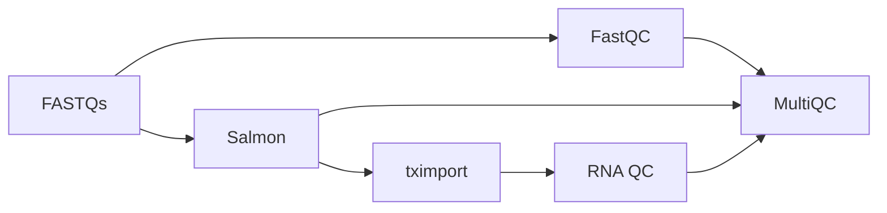

# simple-nextflow-salmon

[](https://github.com/Thokas99/simple-nextflow-salmon/actions/workflows/ci.yml)
[](https://github.com/Thokas99/simple-nextflow-salmon/releases)
[](LICENSE)
[](https://www.nextflow.io/)
[](https://nextflow.io/docs/latest/conda.html)
[](https://github.com/Thokas99/simple-nextflow-salmon/pkgs/container/simple-nextflow-salmon)
[](CITATION.cff)

`simple-nextflow-salmon` is a small, reproducible paired-end bulk RNA-seq workflow. It runs FastQC, full-decoy Salmon selective-alignment quantification, and gene-level tximport aggregation, then brings the read and RNA-level QC together in MultiQC.


```mermaid
flowchart LR
  A[FASTQs] --> B[FastQC]
  A --> C[Salmon]
  C --> D[tximport]
  B --> E[MultiQC]
  C --> E
  D --> F[RNA QC]
  F --> E
```

## Quick start

Install Java 17+, Nextflow `>=24.10.0`, and Conda or Micromamba. The recommended local and HPC runtime is `-profile conda`; Nextflow creates and manages the environment.

Run the released workflow directly from GitHub with automatic FASTQ discovery:

```bash
NXF_ANSI_LOG=0 nextflow run Thokas99/simple-nextflow-salmon \
  -r v0.4.0 -profile conda \
  --fastq_dir /data/fastqs \
  --reference_dir /data/reference/GRCh38_GENCODE/raw \
  --outdir results
```

Or provide an explicit samplesheet:

```bash
NXF_ANSI_LOG=0 nextflow run Thokas99/simple-nextflow-salmon \
  -r v0.4.0 -profile conda \
  --samplesheet samplesheet.csv \
  --reference_dir /data/reference/GRCh38_GENCODE/raw \
  --outdir results
```

To run the current checkout:

```bash
NXF_ANSI_LOG=0 nextflow run . -profile conda \
  --fastq_dir /data/fastqs \
  --reference_dir /data/reference/GRCh38_GENCODE/raw \
  --outdir results
```

`NXF_ANSI_LOG=0` (equivalent to `-ansi-log false`) disables Nextflow's animated ANSI status display and produces ordinary line-oriented logs. This is useful for `nohup`, log files, HPC schedulers, and long sequencing runs.

For a detached background run:

```bash
NXF_ANSI_LOG=0 nohup nextflow run Thokas99/simple-nextflow-salmon \
  -r v0.4.0 -profile conda \
  --fastq_dir /data/fastqs \
  --reference_dir /data/reference/GRCh38_GENCODE/raw \
  --outdir results \
  > salmon-run.log 2>&1 &
echo $!
```

Follow progress with `tail -f salmon-run.log`. `nohup` keeps the process running after the terminal disconnects; `> salmon-run.log 2>&1 &` sends output to a file and backgrounds the command.

## Input

Use exactly one of `--fastq_dir` and `--samplesheet`.

Automatic discovery accepts `.fastq`, `.fastq.gz`, `.fq`, and `.fq.gz` files. Select `--fastq_naming auto|illumina|mgi|simple`:

- `simple`: `SAMPLE_R1.fastq.gz`, `SAMPLE_R2.fastq.gz`
- `illumina`: `SAMPLE_S1_L001_R1_001.fastq.gz`, with lanes and chunks grouped under `SAMPLE`
- `mgi`: `V350387909_L01_UDB001_1.fq.gz`, with lanes grouped under `UDB001`

`auto` accepts only unambiguous supported names. Orphan mates, duplicate assignments, duplicate rows, unsafe sample IDs, basename collisions, and mixed naming conventions fail with file-specific errors. Technical lanes are represented by repeated sample rows.

An explicit samplesheet is a CSV with this header and one row per FASTQ pair:

```csv
sample,fastq_1,fastq_2
UDB001,/data/fastqs/UDB001_R1.fastq.gz,/data/fastqs/UDB001_R2.fastq.gz
```

The exact normalized mapping consumed by the workflow is always written to `results/pipeline_info/resolved_samplesheet.csv` (or the corresponding `--outdir`).

## Reference

For the defaults (`--gencode_release 50 --genome_patch 14`), provide:

```text
/data/reference/GRCh38_GENCODE/raw/
├── gencode.v50.transcripts.fa.gz
├── GRCh38.p14.genome.fa.gz
└── gencode.v50.chr_patch_hapl_scaff.annotation.gtf.gz
```

The workflow builds and reuses an immutable, source-fingerprinted full-decoy Salmon cache. Its identity includes reference release and patch, source SHA-256 fingerprints, the Salmon version from the committed Conda environment, index k-mer, and index options. See [reference caching](docs/reference-cache.md).

## Outputs

```text
results/
├── qc/{fastqc,multiqc}/
├── qc/salmon_metrics.tsv
├── salmon/<sample>/quant.sf
├── tximport/
├── summary/sample_count_summary.tsv
└── pipeline_info/{resolved_samplesheet.csv,run_provenance.json,...}
```

Salmon produces fractional estimated fragment counts, TPM, and effective lengths. tximport produces gene-level estimated-count, TPM, effective-length, annotation, `tx2gene`, and RDS outputs.

## QC and MultiQC

The report contains the native FastQC and Salmon modules together with pipeline-specific RNA QC. Native Salmon metadata supplies fields such as processed fragments, mapped fragments, mapping percentage, detected library type, fragment-length statistics, and Salmon version. The custom section adds post-tximport `Estimated library` and `Detected genes` columns.

QC values are reported for review. The workflow does not automatically filter samples or assign PASS/FAIL decisions.

## Conda / execution profiles

`-profile conda` is the primary local and HPC path. It enables Micromamba and uses the pinned [`envs/salmon-rnaseq.yml`](envs/salmon-rnaseq.yml) environment; manual activation is not required.

Use `-profile ci` for small CI-safe resources. The miniature workflow tests compose profiles as `-profile conda,ci`. Container profiles use `ghcr.io/thokas99/simple-nextflow-salmon:0.4.0`.

## Reproducibility

Pin a release tag or commit and retain the raw references, resolved samplesheet, cache manifest, run provenance, execution trace, and tximport RDS. Use `-resume` for interrupted runs and `--validate_only true` before expensive work.

## Citation

See [`CITATION.cff`](CITATION.cff). Cite Salmon, tximport, FastQC, MultiQC, and Nextflow as appropriate for your analysis.

## Development

```bash
python3 -m unittest discover -s tests -p 'test_*.py'
bash tests/test_validation.sh
bash tests/test_stub_workflow.sh
bash tests/test_real_workflow.sh
NXF_SYNTAX_PARSER=v2 nextflow lint .
git diff --check
```

See [installation](docs/installation.md), [input rules](docs/inputs.md), [local execution](docs/local-execution.md), and [release procedure](docs/release.md).
